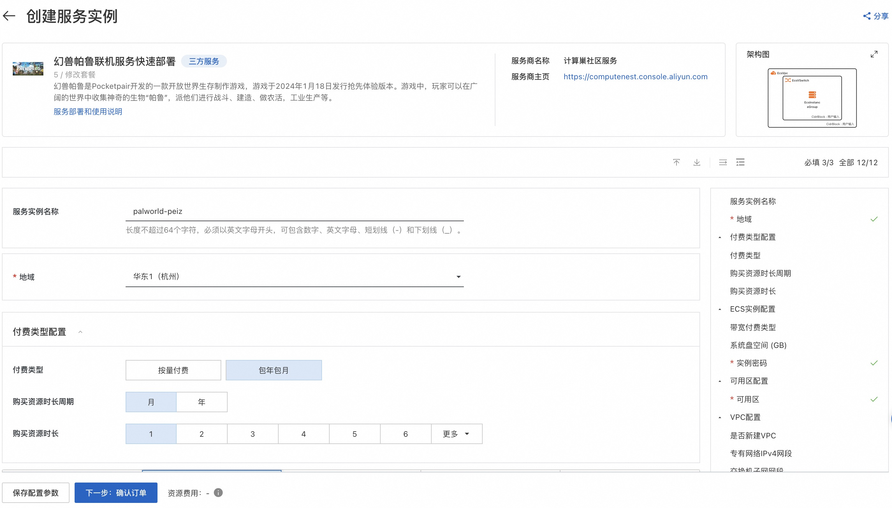
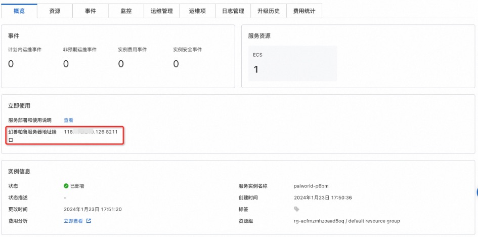

# 计算巢1分钟部署幻兽帕鲁联机服务

## 概述

幻兽帕鲁是Pocketpair开发的一款开放世界生存制作游戏，游戏于2024年1月18日发行抢先体验版本。游戏中，玩家可以在广阔的世界中收集神奇的生物“帕鲁”，派他们进行战斗、建造、做农活，工业生产等。本文介绍如何在计算巢快速部署幻兽帕鲁联机服务，实现和朋友一起联机游戏，预计部署时间1~
2分。

## 计费说明

幻兽帕鲁联机服务在计算巢上的费用主要涉及：

- 所选vCPU与内存规格
- 磁盘容量
- 公网带宽

计费方式包括：

- 按量付费（小时）
- 包年包月

预估费用在创建实例时可实时看到。

## 部署架构

幻兽帕鲁联机服务是单机部署架构

## RAM账号所需权限

幻兽帕鲁联机服务需要对ECS、VPC等资源进行访问和创建操作，若您使用RAM用户创建服务实例，需要在创建服务实例前，对使用的RAM用户的账号添加相应资源的权限。添加RAM权限的详细操作，请参见[为RAM用户授权](https://help.aliyun.com/document_detail/121945.html)
。所需权限如下表所示。

| 权限策略名称                          | 备注                         |
|---------------------------------|----------------------------|
| AliyunECSFullAccess             | 管理云服务器服务（ECS）的权限           |
| AliyunVPCFullAccess             | 管理专有网络（VPC）的权限             |
| AliyunROSFullAccess             | 管理资源编排服务（ROS）的权限           |
| AliyunComputeNestUserFullAccess | 管理计算巢服务（ComputeNest）的用户侧权限 |
| AliyunCloudMonitorFullAccess    | 管理云监控（CloudMonitor）的权限     |

## 部署流程

### 部署服务

1. 单击[部署链接](https://computenest.console.aliyun.com/service/instance/create/cn-hangzhou?type=user&ServiceId=service-f99b27842d464c02846f)
，进入服务实例部署界面，根据界面提示，填写参数并确认订单后点击立即创建。
   

2. 待服务实例创建完成后在概览页获取幻兽帕鲁服务器地址端口。
   

### 登录游戏

前置条件：您首先需要在Steam购买幻兽帕鲁（Palworld）。

1. 登录您的Steam账号。

   

2. 在“库”中找到幻兽帕鲁，并开始游戏。
   

3. 在游戏菜单选择“加入多人游戏（专用服务器）”
   

4. 让玩家输入您已部署的计算巢服务实例的地址端口即可畅快开玩～
   

至此，您已经成功搭建了幻兽帕鲁 Dedicated Server ，请和您的朋友在此中一起畅快游玩吧～

### 修改配置

1. 远程连接ECS实例

   

2. 编辑文件

   ```
   # 修改前注意备份
   vim /home/ecs-assist-user/.steam/SteamApps/common/PalServer/DefaultPalWorldSettings.ini
   
   # 修改后重启服务
   systemctl restart pal-server
   ```
   配置文件参数说明:
   <table><thead><tr><th style="text-align:left"><div><div class="table-header">

   Difficulty
   </div></div></th><th style="text-align:left"><div><div class="table-header">
   
   英文
   </div></div></th><th style="text-align:left"><div><div class="table-header">
   
   机翻
   </div></div></th></tr></thead><tbody><tr><td style="text-align:left"><div><div class="table-cell">
   
   DayTimeSpeedRate
   </div></div></td><td style="text-align:left"><div><div class="table-cell">
   
   Day time speed
   </div></div></td><td style="text-align:left"><div><div class="table-cell">
   
   白天速度
   </div></div></td></tr><tr><td style="text-align:left"><div><div class="table-cell">
   
   NightTimeSpeedRate
   </div></div></td><td style="text-align:left"><div><div class="table-cell">
   
   Night time speed
   </div></div></td><td style="text-align:left"><div><div class="table-cell">
   
   夜间速度
   </div></div></td></tr><tr><td style="text-align:left"><div><div class="table-cell">
   
   ExpRate
   </div></div></td><td style="text-align:left"><div><div class="table-cell">
   
   EXP rate
   </div></div></td><td style="text-align:left"><div><div class="table-cell">
   
   经验率
   </div></div></td></tr><tr><td style="text-align:left"><div><div class="table-cell">
   
   PalCaptureRate
   </div></div></td><td style="text-align:left"><div><div class="table-cell">
   
   Pal capture rate
   </div></div></td><td style="text-align:left"><div><div class="table-cell">
   
   好友捕获率
   </div></div></td></tr><tr><td style="text-align:left"><div><div class="table-cell">
   
   PalSpawnNumRate
   </div></div></td><td style="text-align:left"><div><div class="table-cell">
   
   Pal appearance rate
   </div></div></td><td style="text-align:left"><div><div class="table-cell">
   
   Pal出现率
   </div></div></td></tr><tr><td style="text-align:left"><div><div class="table-cell">
   
   PalDamageRateAttack
   </div></div></td><td style="text-align:left"><div><div class="table-cell">
   
   Damage from pals multipiler
   </div></div></td><td style="text-align:left"><div><div class="table-cell">
   
   好友倍增器造成的伤害
   </div></div></td></tr><tr><td style="text-align:left"><div><div class="table-cell">
   
   PalDamageRateDefense
   </div></div></td><td style="text-align:left"><div><div class="table-cell">
   
   Damage to pals multipiler
   </div></div></td><td style="text-align:left"><div><div class="table-cell">
   
   对好友倍增器造成伤害
   </div></div></td></tr><tr><td style="text-align:left"><div><div class="table-cell">
   
   PlayerDamageRateAttack
   </div></div></td><td style="text-align:left"><div><div class="table-cell">
   
   Damage from player multipiler
   </div></div></td><td style="text-align:left"><div><div class="table-cell">
   
   玩家倍增造成的伤害
   </div></div></td></tr><tr><td style="text-align:left"><div><div class="table-cell">
   
   PlayerDamageRateDefense
   </div></div></td><td style="text-align:left"><div><div class="table-cell">
   
   Damage to player multipiler
   </div></div></td><td style="text-align:left"><div><div class="table-cell">
   
   对玩家造成的伤害乘数
   </div></div></td></tr><tr><td style="text-align:left"><div><div class="table-cell">
   
   PlayerStomachDecreaceRate
   </div></div></td><td style="text-align:left"><div><div class="table-cell">
   
   Player hunger depletion rate
   </div></div></td><td style="text-align:left"><div><div class="table-cell">
   
   玩家饥饿消耗率
   </div></div></td></tr><tr><td style="text-align:left"><div><div class="table-cell">
   
   PlayerStaminaDecreaceRate
   </div></div></td><td style="text-align:left"><div><div class="table-cell">
   
   Player stamina reduction rate
   </div></div></td><td style="text-align:left"><div><div class="table-cell">
   
   玩家体力减少率
   </div></div></td></tr><tr><td style="text-align:left"><div><div class="table-cell">
   
   PlayerAutoHPRegeneRate
   </div></div></td><td style="text-align:left"><div><div class="table-cell">
   
   Player auto HP regeneration rate
   </div></div></td><td style="text-align:left"><div><div class="table-cell">
   
   玩家自动HP回复率
   </div></div></td></tr><tr><td style="text-align:left"><div><div class="table-cell">
   
   PlayerAutoHpRegeneRateInSleep
   </div></div></td><td style="text-align:left"><div><div class="table-cell">
   
   Player sleep HP regeneration rate
   </div></div></td><td style="text-align:left"><div><div class="table-cell">
   
   玩家睡眠HP回复率
   </div></div></td></tr><tr><td style="text-align:left"><div><div class="table-cell">
   
   PalStomachDecreaceRate
   </div></div></td><td style="text-align:left"><div><div class="table-cell">
   
   Pal hunger depletion rate
   </div></div></td><td style="text-align:left"><div><div class="table-cell">
   
   伙伴饥饿消耗率
   </div></div></td></tr><tr><td style="text-align:left"><div><div class="table-cell">
   
   PalStaminaDecreaceRate
   </div></div></td><td style="text-align:left"><div><div class="table-cell">
   
   Pal stamina reduction rate
   </div></div></td><td style="text-align:left"><div><div class="table-cell">
   
   帕尔耐力减少率
   </div></div></td></tr><tr><td style="text-align:left"><div><div class="table-cell">
   
   PalAutoHPRegeneRate
   </div></div></td><td style="text-align:left"><div><div class="table-cell">
   
   Pal auto HP regeneration rate
   </div></div></td><td style="text-align:left"><div><div class="table-cell">
   
   Pal自动HP回复率
   </div></div></td></tr><tr><td style="text-align:left"><div><div class="table-cell">
   
   PalAutoHpRegeneRateInSleep
   </div></div></td><td style="text-align:left"><div><div class="table-cell">
   
   Pal sleep health regeneration rate (in Palbox)
   </div></div></td><td style="text-align:left"><div><div class="table-cell">
   
   Pal 睡眠健康恢复率（Palbox 中）
   </div></div></td></tr><tr><td style="text-align:left"><div><div class="table-cell">
   
   BuildObjectDamageRate
   </div></div></td><td style="text-align:left"><div><div class="table-cell">
   
   Damage to structure multipiler
   </div></div></td><td style="text-align:left"><div><div class="table-cell">
   
   多层结构损坏
   </div></div></td></tr><tr><td style="text-align:left"><div><div class="table-cell">
   
   BuildObjectDeteriorationDamageRate
   </div></div></td><td style="text-align:left"><div><div class="table-cell">
   
   Structure determination rate
   </div></div></td><td style="text-align:left"><div><div class="table-cell">
   
   结构测定率
   </div></div></td></tr><tr><td style="text-align:left"><div><div class="table-cell">
   
   CollectionDropRate
   </div></div></td><td style="text-align:left"><div><div class="table-cell">
   
   Getherable items multipiler
   </div></div></td><td style="text-align:left"><div><div class="table-cell">
   
   可收集物品倍增器
   </div></div></td></tr><tr><td style="text-align:left"><div><div class="table-cell">
   
   CollectionObjectHpRate
   </div></div></td><td style="text-align:left"><div><div class="table-cell">
   
   Getherable objects HP multipiler
   </div></div></td><td style="text-align:left"><div><div class="table-cell">
   
   可收集的物体 HP 倍增器
   </div></div></td></tr><tr><td style="text-align:left"><div><div class="table-cell">
   
   CollectionObjectRespawnSpeedRate
   </div></div></td><td style="text-align:left"><div><div class="table-cell">
   
   Getherable objects respawn interval
   </div></div></td><td style="text-align:left"><div><div class="table-cell">
   
   可收集物体的重生间隔
   </div></div></td></tr><tr><td style="text-align:left"><div><div class="table-cell">
   
   EnemyDropItemRate
   </div></div></td><td style="text-align:left"><div><div class="table-cell">
   
   Dropped Items Multipiler
   </div></div></td><td style="text-align:left"><div><div class="table-cell">
   
   掉落物品倍增器
   </div></div></td></tr><tr><td style="text-align:left"><div><div class="table-cell">
   
   DeathPenalty
   </div></div></td><td style="text-align:left"><div><div class="table-cell">
   
   Death penalty None : No lost, Item : Lost item without equipment, ItemAndEquipment : Lost item and equipment, All : Lost
   All item, equipment, pal(in inventory)
   </div></div></td><td style="text-align:left"><div><div class="table-cell">
   
   死刑 None : 没有丢失， Item : 丢失的没有装备的物品， ItemAndEquipment : 丢失的物品和装备， All : 丢失所有物品、装备、朋友（库存中）
   </div></div></td></tr><tr><td style="text-align:left"><div><div class="table-cell">
   
   GuildPlayerMaxNum
   </div></div></td><td style="text-align:left"><div><div class="table-cell">
   
   Max player of Guild
   </div></div></td><td style="text-align:left"><div><div class="table-cell">
   
   公会最大玩家数
   </div></div></td></tr><tr><td style="text-align:left"><div><div class="table-cell">
   
   PalEggDefaultHatchingTime
   </div></div></td><td style="text-align:left"><div><div class="table-cell">
   
   Time(h) to incubate massive egg
   </div></div></td><td style="text-align:left"><div><div class="table-cell">
   
   孵化大蛋的时间(h)
   </div></div></td></tr><tr><td style="text-align:left"><div><div class="table-cell">
   
   ServerPlayerMaxNum
   </div></div></td><td style="text-align:left"><div><div class="table-cell">
   
   Maximum number of people who can join the server
   </div></div></td><td style="text-align:left"><div><div class="table-cell">
   
   服务器最多可加入人数
   </div></div></td></tr><tr><td style="text-align:left"><div><div class="table-cell">
   
   ServerName
   </div></div></td><td style="text-align:left"><div><div class="table-cell">
   
   Server name
   </div></div></td><td style="text-align:left"><div><div class="table-cell">
   
   服务器名称
   </div></div></td></tr><tr><td style="text-align:left"><div><div class="table-cell">
   
   ServerDescription
   </div></div></td><td style="text-align:left"><div><div class="table-cell">
   
   Server description
   </div></div></td><td style="text-align:left"><div><div class="table-cell">
   
   服务器描述
   </div></div></td></tr><tr><td style="text-align:left"><div><div class="table-cell">
   
   AdminPassword
   </div></div></td><td style="text-align:left"><div><div class="table-cell">
   
   AdminPassword
   </div></div></td><td style="text-align:left"><div><div class="table-cell">
   
   管理员密码
   </div></div></td></tr><tr><td style="text-align:left"><div><div class="table-cell">
   
   ServerPassword
   </div></div></td><td style="text-align:left"><div><div class="table-cell">
   
   Set the server password.
   </div></div></td><td style="text-align:left"><div><div class="table-cell">
   
   设置服务器密码。
   </div></div></td></tr><tr><td style="text-align:left"><div><div class="table-cell">
   
   PublicPort
   </div></div></td><td style="text-align:left"><div><div class="table-cell">
   
   Public port number
   </div></div></td><td style="text-align:left"><div><div class="table-cell">
   
   公共端口号
   </div></div></td></tr><tr><td style="text-align:left"><div><div class="table-cell">
   
   PublicIP
   </div></div></td><td style="text-align:left"><div><div class="table-cell">
   
   Public IP
   </div></div></td><td style="text-align:left"><div><div class="table-cell">
   
   公共IP
   </div></div></td></tr><tr><td style="text-align:left"><div><div class="table-cell">
   
   RCONEnabled
   </div></div></td><td style="text-align:left"><div><div class="table-cell">
   
   Enable RCON
   </div></div></td><td style="text-align:left"><div><div class="table-cell">
   
   启用RCON
   </div></div></td></tr><tr><td style="text-align:left"><div><div class="table-cell">
   
   RCONPort
   </div></div></td><td style="text-align:left"><div><div class="table-cell">
   
   Port number for RCON
   </div></div></td><td style="text-align:left"><div><div class="table-cell">
   
   RCON 的端口号
   </div></div></td></tr></tbody></table>

## 节约成本

前提条件： 部署服务时计费方式选择****按量付费****

使用完毕后可以通过下述两种方式来节省成本：

1. 若只是暂时不使用了可以在运维管理页面选择关机（节省停机模式），此时部分资源会被回收并停止收费，以降低相关费用、节约使用成本，下次使用再进行开机，操作如下：
   
2. 若彻底不再使用了可以直接将服务实例删除，后续就不会再产生费用
   

## 服务支持

您有任何问题或者建议，可以使用微信扫描二维码，加人我们的官方服务群，我们将非常欢迎您的建议和反馈～


