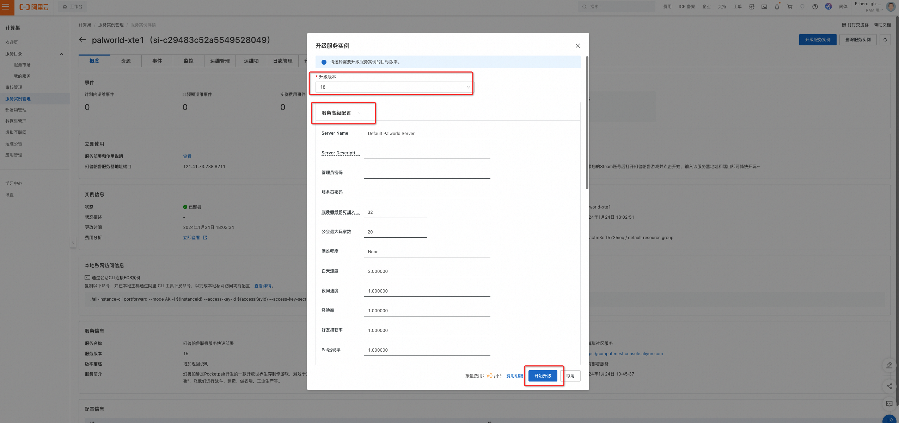
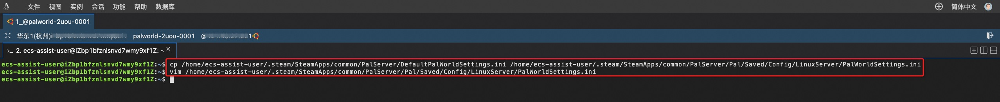
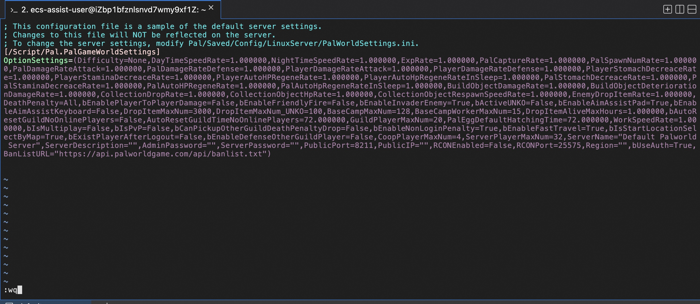
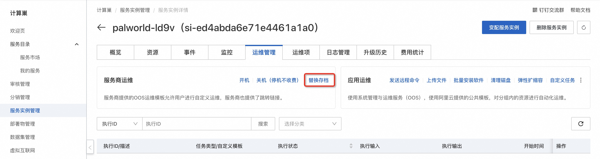
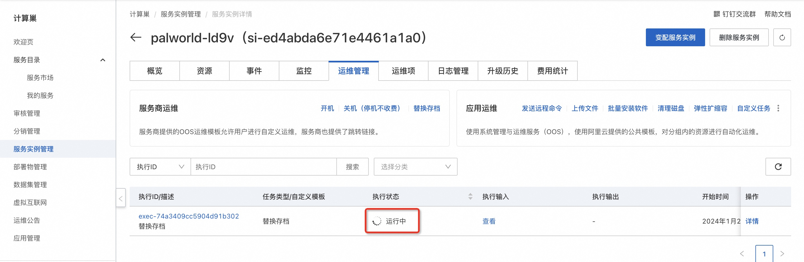
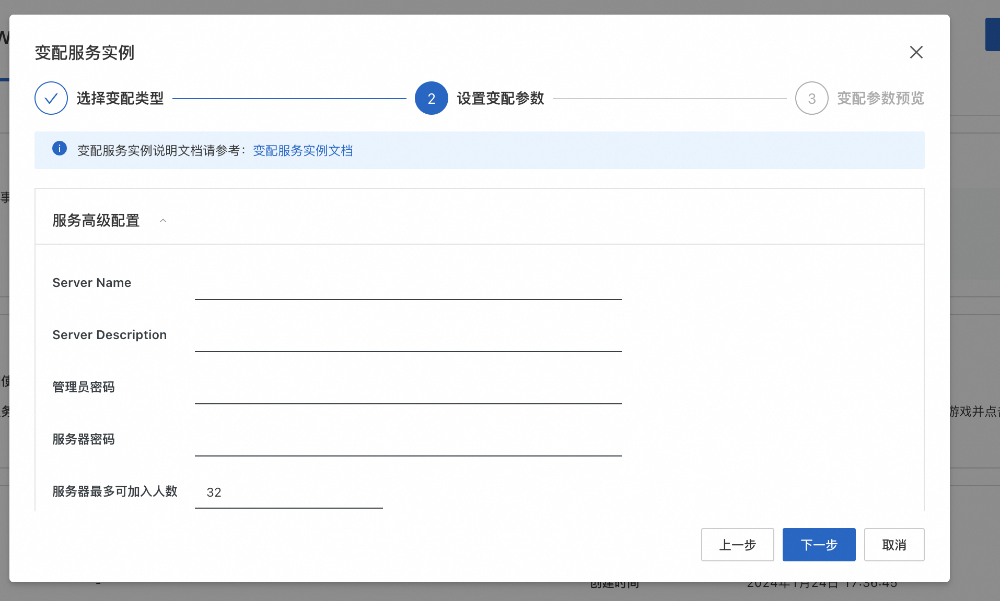

# 1分钟部署幻兽帕鲁联机服务

## 概述

	幻兽帕鲁是Pocketpair开发的一款开放世界生存制作游戏，游戏于2024年1月18日发行抢先体验版本。游戏中，玩家可以在广阔的世界中收集神奇的生物“帕鲁”，派他们进行战斗、建造、做农活，工业生产等。本文介绍如何在阿里云计算巢控制台，快速部署幻兽帕鲁联机服务，实现和朋友一起联机游戏。
	预计部署时间1~2分钟，有任何问题请查看文档底部的微信二维码，进群交流～

## 计费说明

幻兽帕鲁联机服务在计算巢上的费用主要涉及：所选vCPU与内存规格、磁盘容量、公网带宽
计费方式包括：包年包月、按量付费（小时）
预估费用在创建实例时可实时看到。

## 创建云服务器
### 第一步：选择配置
1. 服务实例名称（如无特殊要求，保持默认即可）；
2. 选择部署地域（可以选择离自己最近的城市，如无特殊要求，保持默认即可）；
3. 选择付费时长（一般选择包月，三个月的优惠幅度更大）；
4. 选择配置，一般来说配置越高越流畅。这游戏比较吃内存，所以内存尽量在16G以上（Pocketpair官方的推荐配置是4核16G，详见：[Palworld tech guide](https://tech.palworldgame.com/dedicated-server-guide)，CPU选4核即可，带宽方面推荐不限流量的固定带宽，延时低，畅玩体验更佳。
   
   这里阿里云也根据游戏人数不同推荐了几款配置，大家按需即可 
   - 入门尝鲜（4-8人）：e系列 4核16G，3M带宽不限流量，1个月
   - 入门畅玩（6-10人）：e系列 4核16G，10M带宽不限流量，1个月
   - 驰骋游戏战场（10人以上）：u1系列 4核32G，10M带宽不限流量，1个月
   - 沉浸驰骋体验（10人以上）：u1系列 4核32G，10M带宽不限流量，3个月更长时长
   - 自定义套餐：可自由选择ECS配置，适合高阶DIY玩家。
      

5. 配置服务器密码（记住你的密码，后面要用）；
6. 配置可用区（如无特殊要求，保持默认即可）。
7. 在高级配置栏中配置联机服务的参数（不修改则使用默认值）。
   
⠀配置完成之后，点击下一步，确认提交订单。

### 第二步：创建服务
1. 在服务确认页面，勾选同意服务条款，点击“立即创建”，后面就是付款流程。
   
2. 当出现提交成功提示，说明服务已经开始创建，点击“去列表查看”，可以看到服务正在部署中。
   
   

### 第三步：进入实例详情
1. 服务不到1分钟即可完成创建，当服务的状态变成“已部署”，点击服务实例ID进入服务详情。
2. 到这一步的时候，帕鲁的服务端安装程序已经预置在服务的镜像里了，无需手动复制，非常方便。
   
3. 看到“幻兽帕鲁服务器地址端口”，这就是你搭建服务器的IP地址了，复制这个地址用于下一步操作。
   


## 登录游戏

前置条件：您首先需要在Steam购买幻兽帕鲁（Palworld）。

1. 登录您的Steam账号。

   

2. 在“库”中找到幻兽帕鲁，并开始游戏。
   

3. 在游戏菜单选择“加入多人游戏（专用服务器）”
   

4. 让玩家输入您已部署的计算巢服务实例的地址端口即可畅快开玩～
   

至此，您已经成功搭建了幻兽帕鲁 Dedicated Server ，请和您的朋友在此中一起畅快游玩吧～

## 自动修改配置

可以使用计算巢提供的升级服务实例功能进行自动修改配置:
   

修改配置参数值后点击**开始升级**：
   


## 手动修改配置

1. 远程连接ECS实例

   

2. 编辑文件

   ```
   # 修改复制文件到目标目录
   cp /home/ecs-assist-user/.steam/SteamApps/common/PalServer/DefaultPalWorldSettings.ini /home/ecs-assist-user/.steam/SteamApps/common/PalServer/Pal/Saved/Config/LinuxServer/PalWorldSettings.ini
   ``` 
   
   ```
   # 执行修改配置文件的命令
   vim /home/ecs-assist-user/.steam/SteamApps/common/PalServer/Pal/Saved/Config/LinuxServer/PalWorldSettings.ini 
   ```
   
   如果不熟悉如何操作，请参考[教程](https://blog.csdn.net/wangyuxiang946/article/details/126560108)中的**编辑模式**部分。

   移动光标找到要修改的位置，按键盘 i 键进入可编辑状态修改文件内容，修改完成按ESC键退出编辑状态，输入 :wq 回车保存文件。
   

   ```
   # 修改完成后重启服务
   sudo systemctl restart pal-server
   ```
   配置文件参数说明:

| 参数                                 | 英文                                                                                                                                                              | 机翻                                                                                      |
|------------------------------------|-----------------------------------------------------------------------------------------------------------------------------------------------------------------|-----------------------------------------------------------------------------------------|
| DayTimeSpeedRate                   | Day time speed                                                                                                                                                  | 白天速度                                                                                    |
| NightTimeSpeedRate                 | Night time speed                                                                                                                                                | 夜间速度                                                                                    |
| ExpRate                            | EXP rate                                                                                                                                                        | 经验率                                                                                     |
| PalCaptureRate                     | Pal capture rate                                                                                                                                                | 好友捕获率                                                                                   |
| PalSpawnNumRate                    | Pal appearance rate                                                                                                                                             | Pal出现率                                                                                  |
| PalDamageRateAttack                | Damage from pals multipiler                                                                                                                                     | 好友倍增器造成的伤害                                                                              |
| PalDamageRateDefense               | Damage to pals multipiler                                                                                                                                       | 对好友倍增器造成伤害                                                                              |
| PlayerDamageRateAttack             | Damage from player multipiler                                                                                                                                   | 玩家倍增造成的伤害                                                                               |
| PlayerDamageRateDefense            | Damage to player multipiler                                                                                                                                     | 对玩家造成的伤害乘数                                                                              |
| PlayerStomachDecreaceRate          | Player hunger depletion rate                                                                                                                                    | 玩家饥饿消耗率                                                                                 |
| PlayerStaminaDecreaceRate          | Player stamina reduction rate                                                                                                                                   | 玩家体力减少率                                                                                 |
| PlayerAutoHPRegeneRate             | Player auto HP regeneration rate                                                                                                                                | 玩家自动HP回复率                                                                               |
| PlayerAutoHpRegeneRateInSleep      | Player sleep HP regeneration rate                                                                                                                               | 玩家睡眠HP回复率                                                                               |
| PalStomachDecreaceRate             | Pal hunger depletion rate                                                                                                                                       | 伙伴饥饿消耗率                                                                                 |
| PalStaminaDecreaceRate             | Pal stamina reduction rate                                                                                                                                      | 帕尔耐力减少率                                                                                 |
| PalAutoHPRegeneRate                | Pal auto HP regeneration rate                                                                                                                                   | Pal自动HP回复率                                                                              |
| PalAutoHpRegeneRateInSleep         | Pal sleep health regeneration rate (in Palbox)                                                                                                                  | Pal 睡眠健康恢复率（Palbox 中）                                                                   |
| BuildObjectDamageRate              | Damage to structure multipiler                                                                                                                                  | 多层结构损坏                                                                                  |
| BuildObjectDeteriorationDamageRate | Structure determination rate                                                                                                                                    | 结构测定率                                                                                   |
| CollectionDropRate                 | Getherable items multipiler                                                                                                                                     | 可收集物品倍增器                                                                                |
| CollectionObjectHpRate             | Getherable objects HP multipiler                                                                                                                                | 可收集的物体 HP 倍增器                                                                           |
| CollectionObjectRespawnSpeedRate   | Getherable objects respawn interval                                                                                                                             | 可收集物体的重生间隔                                                                              |
| EnemyDropItemRate                  | Dropped Items Multipiler                                                                                                                                        | 掉落物品倍增器                                                                                 |
| DeathPenalty                       | Death penalty None : No lost, Item : Lost item without equipment, ItemAndEquipment : Lost item and equipment, All : Lost All item, equipment, pal(in inventory) | 死刑 None : 没有丢失， Item : 丢失的没有装备的物品， ItemAndEquipment : 丢失的物品和装备， All : 丢失所有物品、装备、朋友（库存中） |
| GuildPlayerMaxNum                  | Max player of Guild                                                                                                                                             | 公会最大玩家数                                                                                 |
| PalEggDefaultHatchingTime          | Time(h) to incubate massive egg                                                                                                                                 | 孵化大蛋的时间(h)                                                                              |
| ServerPlayerMaxNum                 | Maximum number of people who can join the server                                                                                                                | 服务器最多可加入人数                                                                              |
| ServerName                         | Server name                                                                                                                                                     | 服务器名称                                                                                   |
| ServerDescription                  | Server description                                                                                                                                              | 服务器描述                                                                                   |
| AdminPassword                      | AdminPassword                                                                                                                                                   | 管理员密码                                                                                   |
| ServerPassword                     | Set the server password                                                                                                                                         | 设置服务器密码                                                                                 |
| PublicPort                         | Public port number                                                                                                                                              | 公共端口号                                                                                   |
| PublicIP                           | Public IP                                                                                                                                                       | 公共IP                                                                                    |
| RCONEnabled                        | Enable RCON                                                                                                                                                     | 启用RCON                                                                                  |
| RCONPort                           | Port number for RCON                                                                                                                                            | RCON 的端口号                                                                               |
## 替换存档
如果你原来在本地或者其他地方搭建过Palworld服务器，希望把存档转移到云服务器上，可以使用计算巢提供的功能替换： 
### 自动替换
说明：旧服务器存档路径:./Pal/Saved 打包成zip文件，如test.zip，zip文件可以用winzip打包
1. 在运维管理中点击替换存档：
   
2. 上传存档包后点击下一步会直接开始替换存档。
   
3. 等待替换存档的任务执行完成，服务存档中的存档会替换成新存档。
   

### 手动替换

如果你原来在本地或者其他地方搭建过 Palworld 服务器，希望把存档转移到云服务器上，可以把对应的存档文件拷贝到对应的位置：
   ```
   /home/ecs-assist-user/.steam/SteamApps/common/PalServer/Pal/Saved/SaveGames
   ```
然后重启服务：
  ```
  systemctl restart pal-server
  ```

## 服务版本升级
注意： 服务实例升级前一定要备份存档，避免数据丢失

计算巢提供了服务升级功能，可以将服务升级到最新版本，具体操作如下：
   
   
   

## 节约成本

前提条件： 部署服务时计费方式选择****按量付费****

使用完毕后可以通过下述两种方式来节省成本：

1. 若只是暂时不使用了可以在运维管理页面选择关机（节省停机模式），此时部分资源会被回收并停止收费，以降低相关费用、节约使用成本，下次使用再进行开机，操作如下：
   
2. 若彻底不再使用了可以直接将服务实例删除，后续就不会再产生费用
   

## 服务支持

您有任何问题或者建议，可以使用微信扫描二维码，加人我们的官方服务群，我们将非常欢迎您的建议和反馈～


